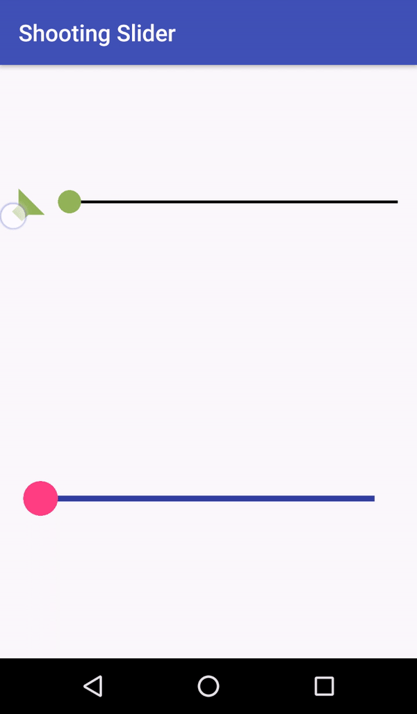

# ShootingSlider




# Usage

Add ShootingSlider the same way like other Adroid views.

```xml
    <com.patryk1007.shootingslider.ShootingSlider
        android:layout_width="match_parent"
        android:layout_height="0dp"
        android:layout_weight="1.5"
        custom:ssLineColor="@color/colorPrimaryDark"
        custom:ssLineSize="5dp"
        android:layout_margin="20dp"
        custom:ssPointColor="@color/colorAccent"
        custom:ssPointSize="15dp"
        custom:ssSoundIconColor="@color/colorPrimaryDark"
        custom:ssSoundIconVisible="true"
        custom:ssNightmareMode="false"/>

```

# Attributes


| attr | description |
|:---|:---|
| ssLineColor | Set slider line color, default #000000 |
| ssLineSize | Set slider line size, default 7 |
| ssPointColor | Set slider point color, default #92B558 |
| ssPointSize | Set slider size, default 30 |
| ssSoundIconColor | Set sound icon color, default #92B558 |
| ssSoundIconVisible | Set sound icon visibility, default true (Visible)  |
| ssNightmareMode |  Active/deactivate nightmare mode, default false (mode disable), If the mode is activated only sound icon is clickable  |

# LICENSE

```
Copyright (C) 2017 patryk1007

Licensed under the Apache License, Version 2.0 (the "License");
you may not use this file except in compliance with the License.
You may obtain a copy of the License at

http://www.apache.org/licenses/LICENSE-2.0

Unless required by applicable law or agreed to in writing, software
distributed under the License is distributed on an "AS IS" BASIS,
WITHOUT WARRANTIES OR CONDITIONS OF ANY KIND, either express or implied.
See the License for the specific language governing permissions and
limitations under the License.
```

[demo_gif]: https://bytebucket.org/moodup/headerviewpager/raw/731ab624167cf459dc8634719de728e0396bcf14/screen/demo1.gif?token=ad81426659b7884ea43e60a7f5d3db0eab359346
